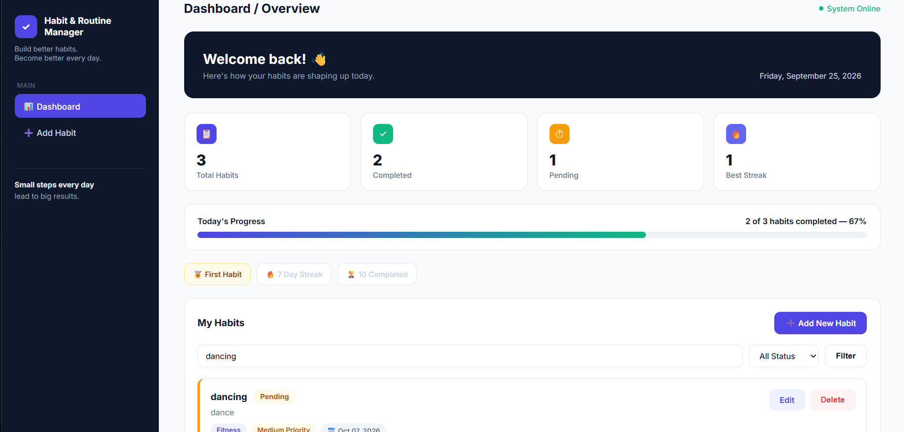
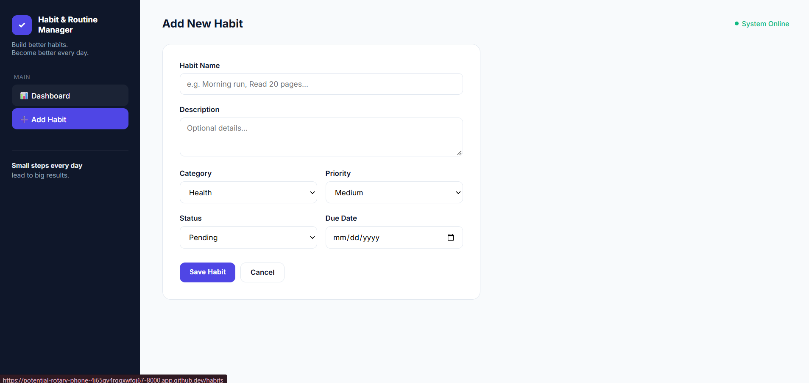
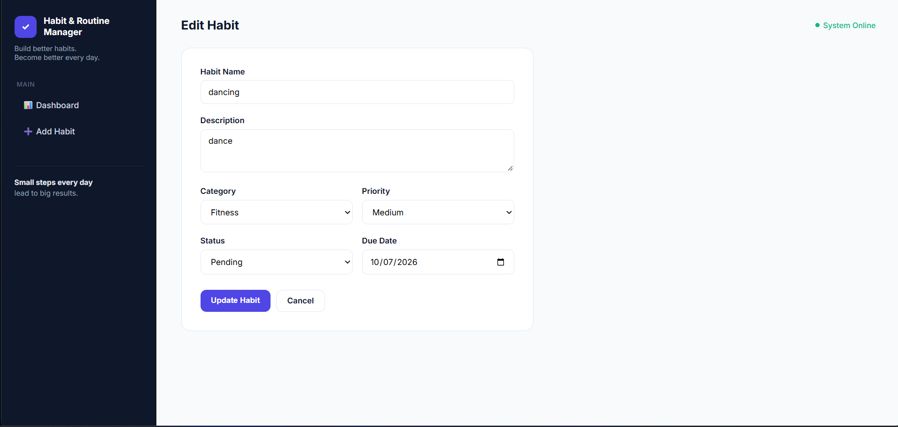

# Habit & Routine Manager

Project Code: WST21-PM-2026-SF

Student Name: Kyle C. Leyson

Course & Year: BSIT 2nd Year

Database Used: SQLite

## About

This is my semi-final project for the Laravel Mini Project. Instead of a
plain task manager, I built a habit and routine tracker where users can add
daily habits, organize them by category and priority, mark them as done,
and see a running streak of how many times they've completed each one.

It follows the Routes → Controller → Model → Database → Blade structure we
learned in class.

## Features

- Add Habit
- View Habits
- Edit Habit
- Delete Habit
- Update Status (Pending / Completed)

I also added a few extra things on top of the requirements:

- Search habits by name
- Filter by status
- Categories (Health, Study, Fitness, Personal, Productivity)
- Priority levels (Low, Medium, High)
- A streak counter that goes up whenever a habit is marked Completed
- Small achievement badges (First Habit, 7 Day Streak, 10 Completed)
- A dashboard with stats (total, completed, pending, best streak) and a progress bar
- A confirmation popup before deleting a habit
- A message shown when there are no habits yet or no search results

## About the streak feature

Since the database only stores one status per habit and doesn't log which
day it was completed, I kept the streak simple: it just adds 1 every time a
habit goes from Pending to Completed. It's not tracking consecutive days,
more like a total completion count, but I wanted to include some form of
streak system without overcomplicating the database.

## Tech Stack

- Laravel
- SQLite
- Blade
- Plain CSS, no framework
- Built using GitHub Codespaces

## Database

The habits table stores: id, habit_name, description, category, priority,
status, streak, due_date, plus the created_at/updated_at timestamps Laravel
adds automatically.

## Screenshots

### Dashboard

### Add Habit

### Edit Habit
